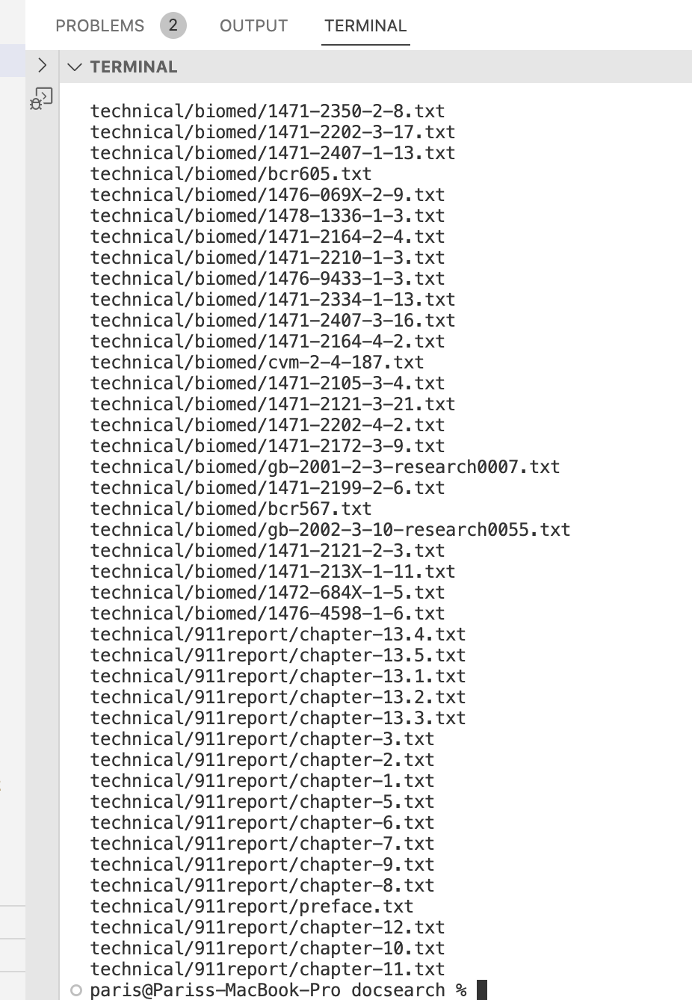

Lab Report 3 - Researching Commands
===

Four Intresting Command Line operations for `find` using directory `technical`

IMPOTRANT INFO: `grep` is command line operation that searches for files in a specific directory

---

**First interesting command-line option**
---

`find ~ -type f`

>This command operation will display files, directories, symlinks, named pipes, sockets, and more using the -type option, which is very useful when wanting to view all the files or directories listed in the directory.
>this would be the following command typed on the terminal:
>
>
>
>Once you have entered the following command it will print all the files and directories etc.
>
>
>

**Using the same command but having a specific file type: `find technical -type f,l -name "Fire*"`**

>This is how it would look typed in the terminal: 
>
>
>
>This command version of find, you can include multiple file types in your search results, which will be helpful in finding a specific file in the directory >by a name or title.
>
>
>
