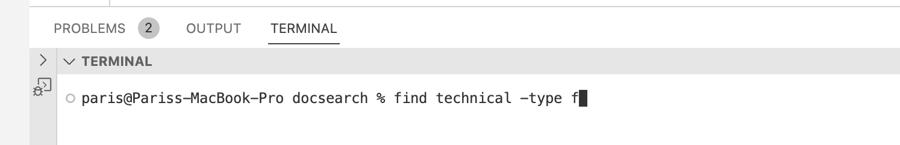

Lab Report 3 - Researching Commands
---

Four Intresting Command Line operations for `find` using directory `technical`

IMPOTRANT INFO: `grep` is command line operation that searches for files in a specific directory

---

##First interesting command-line option

>`find ~ -type f`
>This command operation will display files, directories, symlinks, named pipes, sockets, and more using the -type option

>this would be the following command typed on the terminal:
>

>Once you have entered the following command it will print all the files and directories etc.
>
