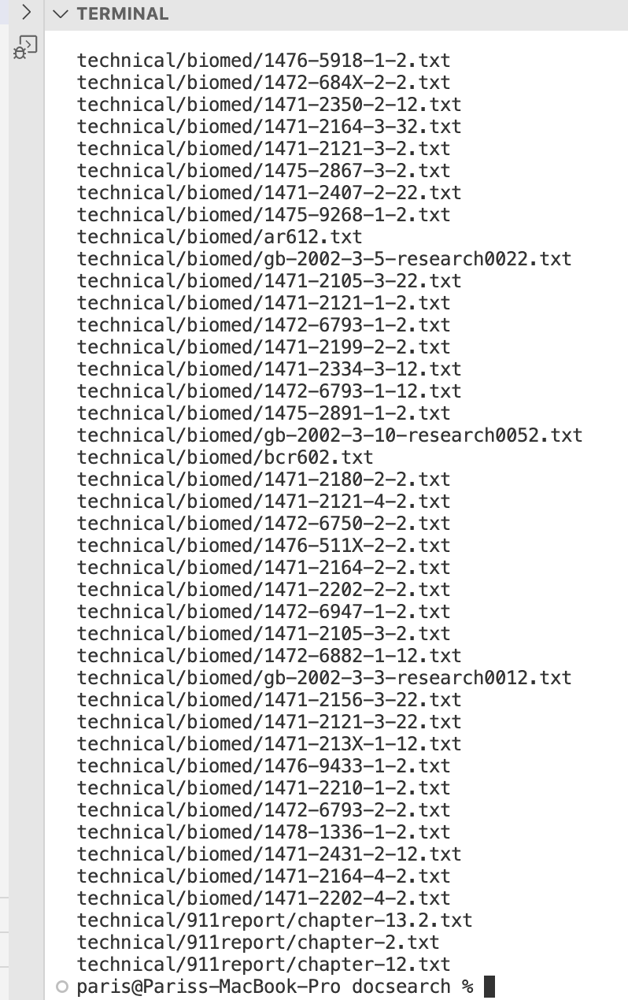

Lab Report 3 - Researching Commands
===

Four Intresting Command Line operations for `find` using directory `technical`

IMPOTRANT INFO: `find` is command line operation that searches for files in a specific directory

---

**First interesting command-line option**
---
-Website Used: [Link](http://www.redhat.com/sysadmin/linux-find-commanda.com)

`find ~ -type f`

>This command operation will display files, directories, symlinks, named pipes, sockets, and more using the -type option, which is very useful when wanting to view all the files or directories listed in the directory.
>this would be the following command typed on the terminal:
>
>
>
>Once you have entered the following command it will print all the files and directories etc.
>
>
>

**Using the same command but having a specific file type: `find technical -type f,l -name "Fire*"`**
-Website Used: [Link](http://www.redhat.com/sysadmin/linux-find-commanda.com)

>This is how it would look typed in the terminal: 
>
>
>
>This command version of find, you can include multiple file types in your search results, which will be helpful in finding a specific file in the directory just by adding the name of th specific file trying to find by using `-name "THE TITLE TRYING TO FIND*"` This command will by directly provide all the possible files with the name implemented
>For Examples the command will look somethhing like this if it found a file with the name I implemented (which in this case it was fire):
>
>
>

**Second interesting command line option**
---
-Website Used: [Link](http://-Website Used: [Link](http://ucsd-cse15l-s23.github.io/week/week5/.com)

`find technical/(directory)`

>This command can be implemented with the file technical and any choice of directory that you know is present in the file
>One directory that I know is there would be `plos`
>
>In this case I will write in the terminal something like this with the command:
>
>
>
>The reason why this command can be helpful when wanting to see a specific directory and what is inside it. For this command it will output whats inside the specific directory I typed (which in this case is `plos` this:
>
>
>

**Using the same command but having a different directory implemented: `biomed`**

-Website Used: [Link](http://-Website Used: [Link](http://ucsd-cse15l-s23.github.io/week/week5/.com)

>Same command will be implemented in the terminal just different directoy:
>
>
>
>This command will be able to show everything that is placed inside the. `biomed` directory
>Which will output something like this:
>
>
>

**Third intresting command line option**
---
-Website Used: [Link](http://-Website Used: [Link](http://ucsd-cse15l-s23.github.io/week/week5/.com)

`find technical -name "title of file that ends with"`

>This command will be able to find all the files that end with the string implemented in qoutes at the end. In this case will will be using star in front of the last numbers to easily find all the files that end with that number of pair. (* will fill out whatever could possibly be in the front of the pair numbers)
>
>For example in the terminal it will look like this:
>
>
>This command is useful to easily find a file by condensing all the possible files that have the string.
>This would be the output of the command:
>
>
>

**Using the same command but a diffrenet string implemented at the end to find**
-Website Used: [Link](http://-Website Used: [Link](http://ucsd-cse15l-s23.github.io/week/week5/.com)

>For this command I will be adding the string `find technical -name "*9.txt"`
>It will look something like this:
>
>
>
>which will provide this output like the example above:
>
>
>

**Fourth intresting command line option**
---
-Website Used: [Link](http://www.redhat.com/sysadmin/linux-find-commanda.com)

`find technical -type f -size -1k` 

>This comand will take all the directories and files in technical and will spcifically find the certain size that I want to find
>For example with this command in the terminal having `-1k` at the end will ony find that specific size within all the directories technical may have
>
>In the terminal it will look something like this:
>
>
>
>The output will only show that directories/files that are valid for the size implemented:
>
>
>

**Using the same command but a different size implemented at the end**
-Website Used: [Link](http://www.redhat.com/sysadmin/linux-find-commanda.com)

>In this case I will be trying `-5k`
>The terminal will look something like this:
>
>
>
>With an output of:
>
>
>
>**NOTE: notice how when I implemented a size of `-0k` before my command of size `-5k` it didnt print any since not file or directory have a size of 0**
